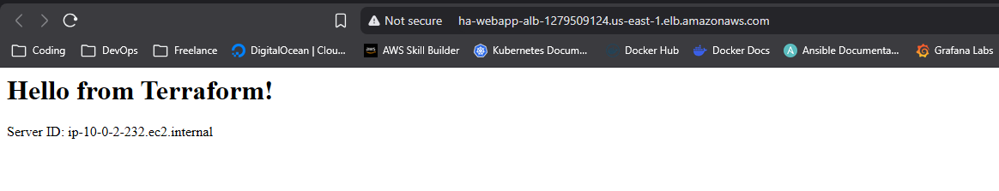

# Terraform AWS High Availability Web App

This project demonstrates a production-ready approach to deploying web infrastructure on AWS using **Terraform**. It focuses on modularity, scalability, and security best practices.

For this demo, to keep costs down (without an expensive NAT Gateway), we will place the application server in the Public Subnet but secure it via Security Group.

## Architecture Overview

The infrastructure is built to be **High Available (HA)** and **Fault Tolerant**, consisting of:

* **Custom VPC:** A secure network environment with segmented public subnets across multiple Availability Zones (AZs).
* **Application Load Balancer (ALB):** Distributes incoming HTTP traffic evenly across healthy instances.
* **Auto Scaling Group (ASG):** Automatically adjusts the number of EC2 instances based on demand and replaces unhealthy nodes.
* **Security Group Chaining:** Implements strict firewall rules where web servers only accept traffic from the Load Balancer.
* **Launch Templates:** Defines the blueprint for server instances, including "User Data" scripts for automated bootstrapping of the Apache Web Server.

## 🛠 Tech Stack

* **Cloud Provider:** AWS (Amazon Web Services)
* **Infrastructure as Code:** Terraform (HCL)
* **Configuration Management:** Bash (User Data Script)
* **Version Control:** Git

## Project Structure

The project follows a modular directory structure to ensure reusability and clean code:

```text
├── modules/
│   ├── networking/   # VPC, Subnets, Route Tables, IGW
│   └── compute/      # EC2, ASG, ALB, Security Groups
├── main.tf           # Root module configuration
├── variables.tf      # Input variables definitions
├── outputs.tf        # Output values (e.g., Load Balancer URL)
└── terraform.tfvars  # Variable values 
```

Use this command for running the project

1. Initialize project
```bash
terraform init
```

2. Make a plan for debug kode
```bash
terraform plan
```

3. Implementing the infrastructure
```bash
terraform apply
```

Project results documentation

1. View the hostname


2. Refresh the browser
